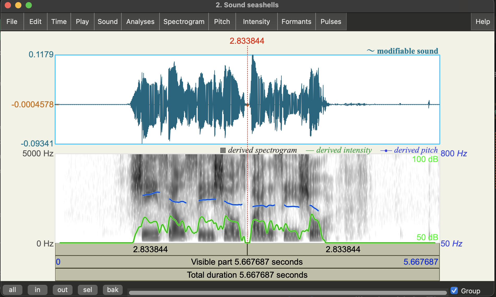
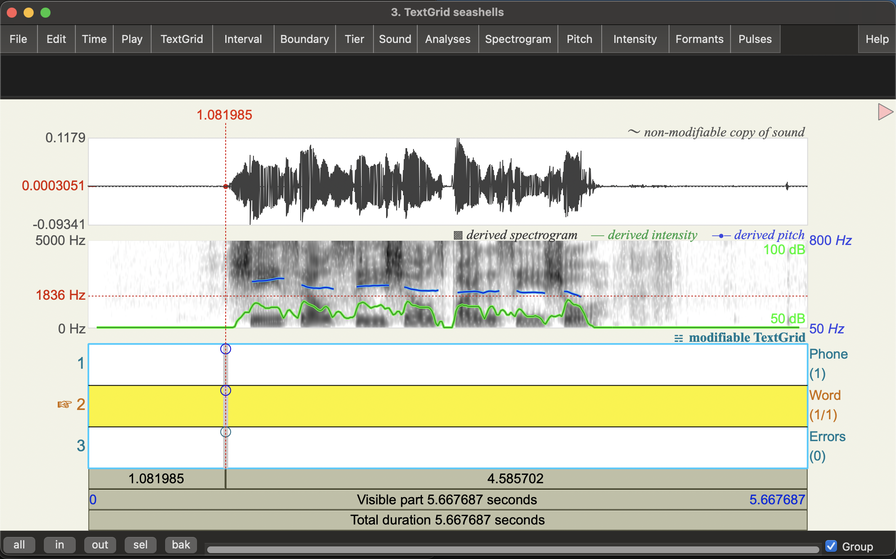
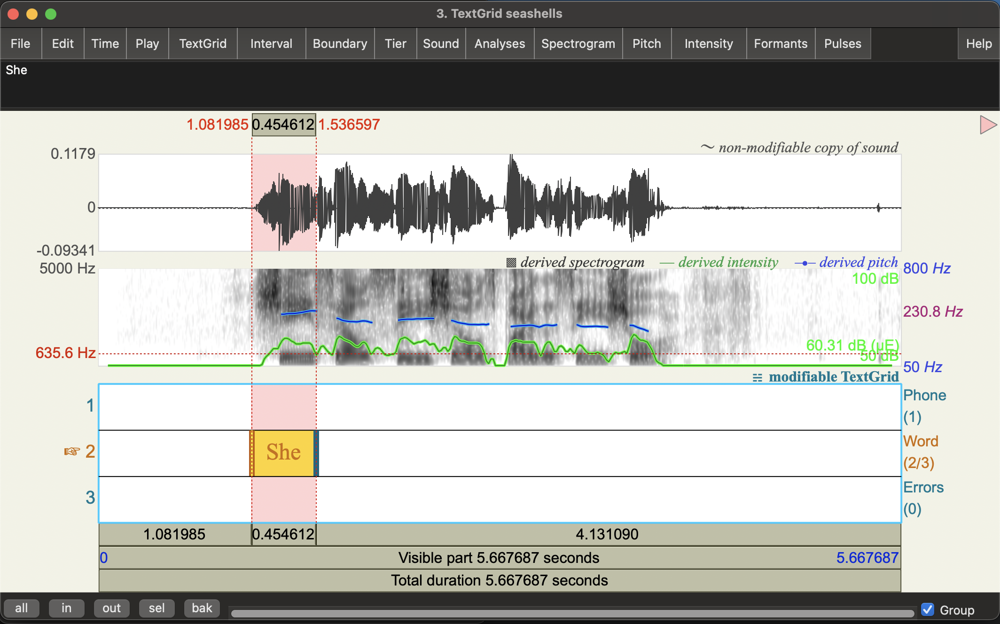
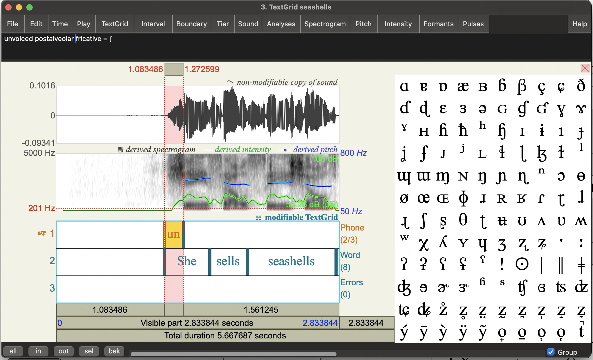
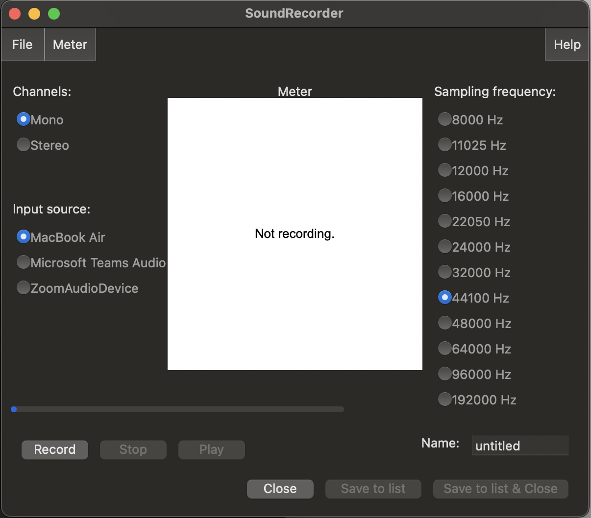
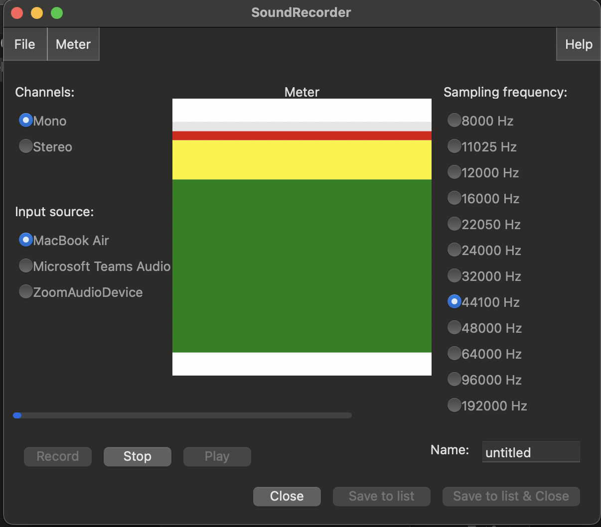

## _Speech Processing Labs: PHON 1: Analysing speech articulations_

# Analysing speech articulations

## Learning Outcomes

* Learn to use phonetics software, Praat, to inspect and annotate audio files
* Practice the mapping between speech articulations and the International Phonetic Alphabet symbols and layout (IPA)
* Practice using phonetics terms related to voicing, place and manner of articulation. 
* Observe complexity of in physical speech production by examining common articulation errors

## Before the lab

* Go through the Module 1 videos and readings
    * These focus on speech articulation and the IPA
* Make sure you have a handy copy of the IPA chart.  You may find it useful to use version with linked audio. 

_You don't need to submit anything for this lab_

# Inspecting speech with Praat

## Get started with Praat
1. Download Praat from [https://www.fon.hum.uva.nl/praat/](https://www.fon.hum.uva.nl/praat/)
2. Follow the install instructions linked from the Praat homepage for your operating system (i.e., Mac, Windows, Linux)
3. Open Praat by double clicking on the icon
    * If it's not obvious where the App was installed, you should be able to find it from the Start menu in Windows, or Spotlight on a Mac. 

After opening Praat you should be able to see two windows: 
* _Praat Objects_: This is the main one we'll work with for loading and manipulating recordings 
* _Praat Picture_: This one is used for plotting.  
    * We won't go into this in this lab, but you can find out more about this (and much more!) in these Praat tutorials by Will Styler: [tutorials](https://wstyler.ucsd.edu/praat/).

## Open a sound file

Download the following sound file to your computer: 
[seashells.wav](audio/seashells.wav)

Open the sound in Praat: 
1. Click `Open` on the _Objects_ windows to show a drop down menu
2. Select `Read from file...`
3. Select the file you want to open from the pop-up window and press `open`

You should now see a line in the Objects list called: _Sound seashells_.  

## Examine the Sound

Praat will allow you to do many things with this new Sound object , but for now let's just open it and have a listen. 

1. Select the _Sound_ object in the object list.  
2. Click on `View & Edit` 

You should see a new window that looks like this: 

The horizontal axis shows different points in time. The panels show different representations of the recording. 

* The top panel shows the waveform, i.e. variation in air pressure in time. 
* The middle panel shows the spectrogram: a representation of the sound frequencies that are present in the recording
    * We properly discuss these in Module 2-3, but for now just consider them as a way to see changes in the speech.   

The bottom three bars give some play back controls, clicking on the bar labelled:
* `Total duration`: will play the entire recording
* `Visible part`: will just play the bit you can see (e.g., if you've zoomed in)
*  The top bar will pay up until the point of the cursor. 

On the bottom left corner you'll see some buttons (`all`, `in`, `out`, `sel`, `bak`).  You can play with them to zoom in and out.  You can move around time but scrolling left or right with your mouse. 

Clicking on different spots will show you different information about the audio at that point in time. For example, in the image above we see red vertical and a horizontal dashed lines. 

* The vertical line represents a point in time: 2.833844 seconds into the recording
* The red horizontal line on the waveform panel gives the waveform amplitude at that point in time: -0.0004578

If you click on the spectrogram panel, you'll also get a red horizontal line that gives you the coordinates of the point you clicked on in the spectrogram where the x-axis (horizontal) is time, and the y-axis (vertical) is frequency (in Hertz).  We won't get into it this week, but it can be helpful for measuring different properties of the spectrogram by hand. 

### Pitch (the blue line)

You may see a blue bar superimposed on the spectrogram (as in the screenshot above).  This represents the estimated pitch at a point in time (more accurately: Fundamental Frequency - we'll talk about this more in Module 2!).  This is estimated using a different algorithm from the spectrogram so the fact that you see it here is really just a design choice from the makers of this software.

You can turn the pitch track on and off by clicking on the `Pitch` menu at the top of the window and checking/unchecking `Show Pitch`.  The default method used here is "filtered autocorrelation" which you can see from the check mark in the menu.  

**Automation Warning:** If the pitch tracking is good (as it is in the example above) you should be able to see a relatively smooth contour that matches your perception of when pitch goes up and down through the speech.  Unfortunately, pitch tracking can be quite prone to error. Almost all pitch trackers are sensitive to the range settings (i.e. expected minimum and maximum pitch values in Hertz).  If the expected range is doesn't really match the speaker's actually range you can get errors like octave doubling and halving.  You will also get errors if the phonation is "non-modal", e.g. creaky or breathy.  Sometimes data driven studies don't bother to check this and then end up with spurious results. 

To change the range settings click on  `Pitch settings` from the `Pitch` menu.  The default range for Praat (50-800Hz) is ok, but you can often do better if you tweak this (e.g., see [this paper](https://doi.org/10.1121/1.3609833)). 

### Intensity (the green line)

Another common overlay is the Intensity estimate (green or yellow).  You can turn this on by going to the `Intensity` Menu and clicking on  `Show Intensity`.  This will essentially give you a measure of the loudness in time (based on the amplitude of the wave).  You should see that the peak structure in this contour broadly represent syllables in the speech.

### Other functions

There are many other menus at the top of the window that will show other overlays (e.g. `Formants`, `Pulses`).  Feel free to click around and see what they do.  You can even use the functions in the `Edit` to cut and paste speech segments!

For the moment, we will just press on and learn what we need to as we go, so we can get started analysing some speech. If you want to learn more about Praat, there are several tutorials linked from the Praat website (which also hosts a lot of documentation): [tutorials page](https://www.fon.hum.uva.nl/praat/manualsByOthers.html). You may also find this video based guide by Richard Ogden (University of York) helpful: [video guide](https://www.york.ac.uk/language/current/resources/praat/).  

# Analysing Tongue twisters

Now that we've got the basics of Praat, let's go back to thinking about speech articulation. Specifically, we're going to use Praat to visualise and analyse what's going on in some tongue twisters!  These  are phrases that are difficult to say properly. Thinking about why they are difficult to articulate will hopefully help better understand difference in place and manner of articulation. 

Let's start with some classic English ones:

1. She sells sea shells by the sea shore
    * [seashells.wav](audio/seashells.wav) (i.e., the file we just opened)
2. Peter Piper picked a peck of pickled peppers
    * Recording
3. Seventy seven benevolent elephants
    * Recording

Please note, for this lab it really doesn't matter if you can say these correctly! In fact, errors will probably be more useful! 

## Articulating tongue twisters

**Task:** Before we start analysing these in Praat, try saying each of these phrases out aloud.  You may wish to take turns with the people next to you in the lab and then discuss the following questions (but it's totally fine to do this on your own). 

**Questions** 
* What parts of these phrases are difficult to say? What words tend be be said incorrectly? Are there specific phones that are difficult? 
* Do you need to speak slower than you usually would to say these correctly?  
* What happens when you try to say them faster? 

We'll do some analysis on these one by one. 

## Example 1: Seashells

You already downloaded an opened the first recording in the previous section: "She sells sea shells by the sea shore".

A big reason Praat is so popular with phoneticians is that it's convenient for annotation.  Let's add some textgrids to do annotations now. 

1. Click on the `Sound seashells` object in the _Objects_ window
2. Click on the `Annotation` button to the right
3. Select `To TextGrid...`

You should see a little popup window named _Sound: To TextGrid_ which you can use to set the annotation parameters. Edit the parameters there as follows: 

4. `All Tier Names`: delete "Mary John bell" and replace it with "Phone Word Errors"
5. `Which of these are point tiers`: write Errors
6. Click `Ok`

You should now see a new `TextGrid seashells` object in the _Objects_ window.  

7. Select both the `Sound seashells` and `TextGrid seashells` objects so both are highlighted and then click on `View & edit`.

You should now see the sound viewer with the waveform and spectrogram up top, but now also 3 blank annotation tiers: `Phone`, `Word`, and `Errors`.  The first two are _interval tiers_, while the last is a _point tier_. As the name suggests, we use interval tiers to annotate spans of time (intervals!), and point tiers to annotate specific points in time.  The choice to make the `Errors` tier a point tier here is a bit abitrary and just for illustrating what you can do with Praat. 

**Toggling the IPA symbol selector:** You'll probably see a large table of IPA symbols on the right of the viewer.  You can use this to add IPA symbols into annotations, but it takes up a lot of space.  So, for the moment, let's just hide this by clicking the pink crossed boxed at the top right of this. You should see it turns to a pink triangle - clicking on this will show the IPA symbol table again. 

### Annotate the words

1. Click on any point in the word tier. You should see it turns yellow. 
2. Find the start of the first word on the waveform (or spectrogram) and click there.  You can do this by listening, but you should also be able to see where the sound starts in the waveform. 

You should see a vertical line with some circles on the text tiers. 

3. Click on the circle at the top of the `Word` tier to make a boundary. You should now see a vertical red line on the Word tier.  
4. Do the same at the end of the first word.  You now have a word interval. 
5. Click in that word interval and type the word in ("She")

6. Continue through the recording an annotate all the words intervals. 

Some things to note: 
* There aren't really any gaps between words: words flow seamlessly into one another.  
* You can see a very brief silence at the beginning of "by" in the waveform, but you won't really hear a pause in the speech.  
    * **Question**: what's happening here in articulatory terms? 
* You need some context and knowledge about a language's written form (orthography) to place word boundaries.  
    * **Question**: When you are transcribing speech how to do you know whether "sea" and "shells" are should transcribed as separate words or as a compound word ("seashells")?

### Annotate syllable initial consonants

The tricksy bit of this tongue twister is the syllable initial consonants (aka syllable _onsets_).  Let's see what's going on by annotating the first phone in each syllable for place and manner, in the phone tier. 

1. Add boundaries for the start and end of the first phone in each of the syllables in the recording.  

2. Using the IPA chart, annotate each the syllable initial phone interval with: 
    * Voicing
    * Place
    * Manner
    * the IPA symbol

The interval box itself will be too small to see the full anotation, but you can see and edit the full thing up the top of the window. Here's the first one as an example (re-expanding the IPA symbol selector): 

### Where does your tongue twist?

1. Try to say the phrase as fast as you can until you start making errors.  
2. Annotate the points where you made errors on the `Error` tier. 
    * This is a point tier, so you'll be creating annotations for specific times rather than intervals. 

**Questions:** 
* What type of mistake are people likely to make with this tongue twister? Is it in articulation of voicing, place or manner? 
* What other factors may be contributing to pronunciation difficulties here? (Hint: does saying words that rhyme make it easier or harder?)

### Waveform vs spectrogram: a preview of acoustic phonetics

Even without any training in spectrogram interpretation (i.e. acoustic phonetics), you should be able to see that fricatives are quite distinctive!  

Questions:
* Based on what you see (i.e. don't worry about technical terms for now): how would you describe what fricatives look like in the spectrogram? 
* What's the differences between [s] and [ʃ] sounds? How about [s] vs [ð]? 
* Can you tell these fricatives apart by just looking at the waveform (i.e. without the spectrogram)? 
* The boundaries of fricatives are relatively clear.  Is this the case for all phones? How about the vowel [ɛ] and following [l] sound in "sells"?

## Example 2: Peter Piper

Tongue-twister: "Peter Piper picked a peck of pickled peppers" 

1. Create similar annotations for the "Peter Piper" tongue twister? 
    * This time you'll want to focus on word internal consonants.
2. What sorts of manner and place variations cause difficulty in this example? 
3. What sorts of errors are speakers likely to make? 
4. What cues are you using to identify _plosives_ (aka oral stops) in the example in terms of waveform and spectrogram. 
    * Can you identify them just from the waveform?  

# Record and analyse your own tongue twister

Now let's try recording a tongue twister yourself and analysing it. If you speak a language other than English, you might like to try one in another language. 

After recording yourself in Praat (see instructions below), try to identify the articulation patterns that cause difficulty.  Again, think about whether the confusions/errors that arise are in terms of placement of articulators.  Describe this in terms of voicing, place and manner for consonants.  For vowels, think about tongue frontness, height, and rounding.  We've focused mostly on consonants in this lab, but don't worry we'll do more on vowels next week. 

## Examples

Some more English example:

* Seventy seven benevolent elephants
* Which wrist watches are Swiss wrist watches?
* Red lorry, yellow lorry, red lorry, yellow lorry

You can find many more on the internet! 

Here are a some tongue twisters in other languages offered up by members of the Centre for Speech Technology Research: 

* Catalan (Ariadna Sanchez): 
    * Setze jutges d'un jutjat mengen fetge d'un penjat
    * "Sixteen judges of a court eat liver off a hangman"

* Spanish (Ariadna Sanchez):
    * Tres tristes tigres comen trigo en un trigal
    * "Three sad tigers eat wheat in a wheat field"

* Icelandic (Atli Sigurgeirsson): 
    * hnoðri í norðri verður að veðri þótt síðar verði.
    * "A small cotton ball (probably meaning a small cloud) in the north becomes weather sooner or later"

* Czech (Ondrej Klejch): 
    * Strč prst skrz krk 
    * "Stick a finger through the neck"

* Mandarin Chinese (Yuanchao Li): 
    * 四是四，十是十，十四是十四，四十是四十，四十四是四十四 
    * Four is four, ten is ten, fourteen is fourteen, forty is forty, forty-four is forty-four.

* Japanese (Yuanchao Li)
    * 生麦、生米、生卵
    * "Raw wheat, raw rice, raw egg"

You can also find many others linked in the description of this video by Hank Green: [Tongue twisters](https://youtu.be/YVlLzjqJvIc?si=d2nG8W9kYA5uiRmM). This also has a nice discussion of why tongue twisters are hard! 

## Make a recording in Praat

1. Click on `New` in the _Praat Objects_ window
2. Select Record mono sound...
3. You should see a _SoundRecorder_ pop up window like the following

There are 3 main parameters you can change: 
* Channels: Mono or Stereo
    * Mono basically records all sound into one channel (i.e.waveform). But if you have a stereo microphone, you can try it to see what the difference is.  
* Input source: which microphone to use
    * If you don't pick up anything on recording, this is the first place to check. 
* Sampling frequency: How often to sample sound (i.e. air pressure) at the microphone.  This is measured in Hertz (Hz) which you can also read as samples per second. 
    * We'll stick with the default 44100 Hz for now.  We'll come back to the difference this makes in module 3, but feel free to play around and see for your self. 

4. Change the _Name_ of the recording from `untitled` to whatever you'd like it to be.
5. Press `Record` to start recording and `Stop` to stop the recording.  

When you start speaking you'll see some colours appear in the the _Meter_ box.  This will tell you if the sound level is at an appropriate level.  If you see some green movement, you should fine.  If you see the meter go into yellow up into red, the sound is too loud to capture faithfully and you likely get distortion in the recording. This usually happens if your microphone volume is too high and/or you're too close to the microphone (we'll come back to this in module 3).  

The following shows the meter going into the red (produced by clapping several times with the microphone set to high volume):

6. You can play back your recording using the `play` button.  When you're happy with it click `Save to list & Close`.  

You should now see a new `Sound` object in the _Objects_ window with the name you gave your recording. 

## Analyse your recording

As for the other examples, add a TextGrid for annotations and inspect the audio. 

* Explain where and why your chosen text is difficult to say in terms of your articulators or any other relevant factors. 
* Annotate the recording to show what is going on.  It may be helpful to make a second recording where you make errors to contrast this to the correct pronunciation! 

# End notes

The goal of this lab was to get you thinking about how people create speech using actual physical articulators in our vocal tracts. Tongue twisters show that [this process, between thinking and speaking, is actually very complicated](https://doi.org/10.1038/nature.2013.12471).  

Speaking is also constrained by the physicality of our actual articulators and respitory systems. It's actually proven very hard to reproduce human speech in purely physical models. You can get an idea of how difficult this problem is by looking at the work from the lab of Prof. Takayuki Arai (Sophia University, Japan).  See this recent paper, for example: 

* [Arai, T., Suzuki, R., Earp, C., Tsuji, S., Ochi, K. (2024) Production of phrases by mechanical models of the human vocal tract. Proc. Interspeech 2024, 987-988](https://www.isca-archive.org/interspeech_2024/arai24_interspeech.html#)

There are several other very interesting demos on the lab's youtube page: [Acoustic-phonetics demonstrations](https://www.youtube.com/@acoustic-phoneticsdemonstr4758) 

You're probably now getting to understand why most humanoid robots don't even attempt include vocal tracts! Instead, we general speech waveforms using non-physical means on computers and play them out some speakers.  To do this we'll need to understand how we can "see speech" just from the waveform: i.e., acoustic phonetics. This is the focus of module 2. 

