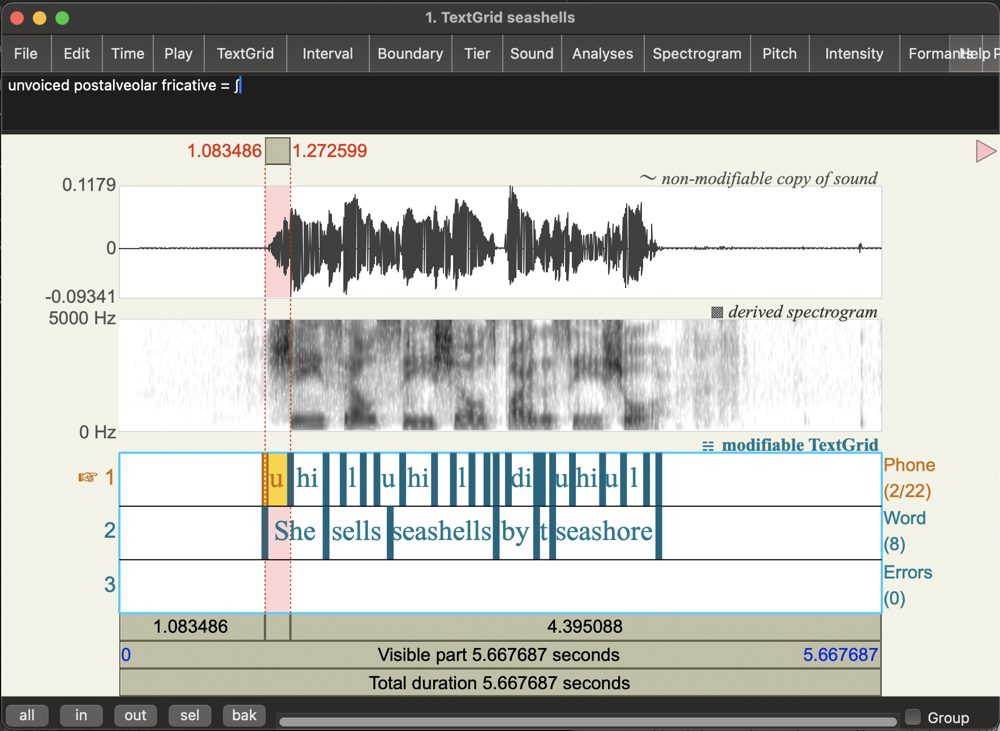
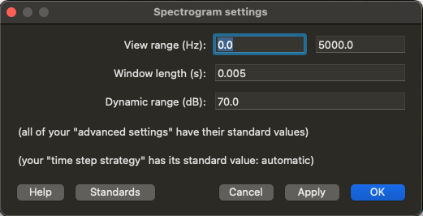
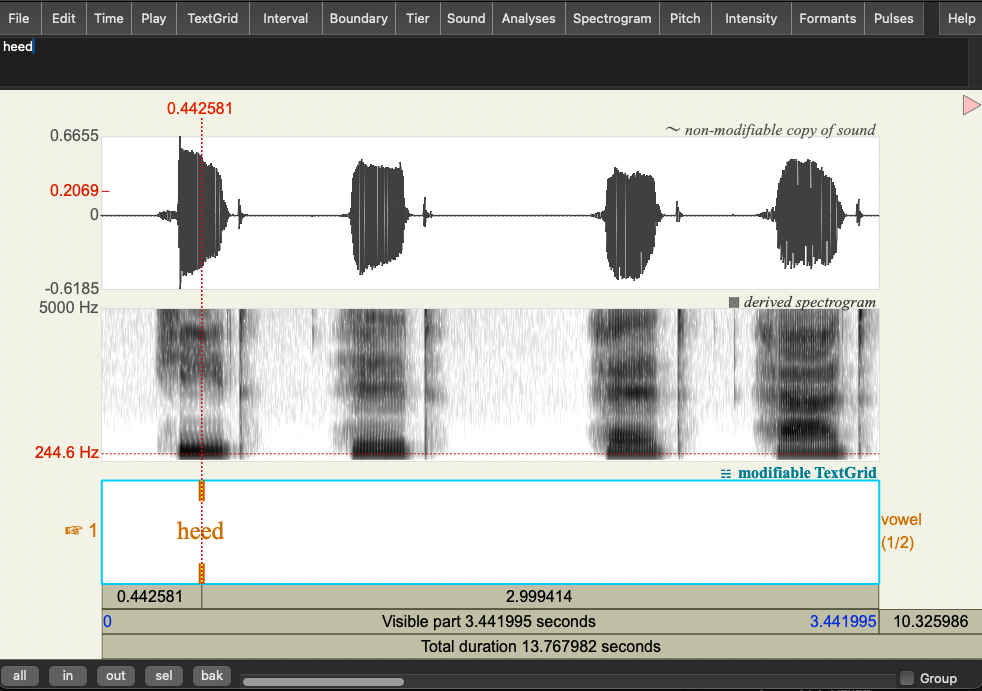

# _Speech Processing Labs: PHON 2: Analysing speech acoustics_

# Analysing speech acoustics 

## Learning Outcomes

* Understand what spectrograms represent with respect to an input audio signal
* Understand what wide-band and narrow-band spectrograms are
* Understand what the fundamental frequency of a periodic signal is and how it can be estimated from the waveform and from a spectrogram
* Observe the relationship between fundamental frequency and its harmonics
* Observe the relationship between vocal tract shape and vowel formants (i.e., resonances of the vocal tract)
* Explore variation in the vowel spaces of different speakers

## Before the lab

* Go through the [Module 2 videos and readings](https://speech.zone/courses/speech-processing/module-2-acoustic-phonetics/)
    * See [Module 1 lab](../phon_lab_1/phon-1-articulation) for an introduction to using Praat
* You may wish to record the word list and "Mary" sentence in the last sections of this lab in a quiet spot before the lab.  

_You don't need to submit anything for this lab_

# Wide-band and Narrow-band Spectrograms

 Spectrograms give us a plot of what frequencies are present in a recording through time: The vertical axis represents different frequencies, the horizontal axis represents time, the darkness of each coordinate (i.e., (time, frequency) point) in Praat represents the magnitude of that frequency in the input signal (waveform).  The darker the spot, the higher the amplitude of that specific frequency (you can think of this as the volume or loudness of that specific frequency as a pure tone).  

As discussed in class, applications like Praat generate spectrograms by applying the (Discrete) Fourier Transform to short windows in time.  Changing the window size of that window changes what information you get out.  

## Changing Spectrogram Settings

1. Open the [seashells.wav](../phon_lab_1/audio/seashells.wav) recording from the module 1 lab. 
    * You may find it handy to use your consonant and vowel annotations from last week to get oriented. 
2. View the `seashells` _Sound_ object (and TextGrid annotations from last week if you have it)

    You should see something like this: 

    

3. In the sound viewer, Click on the `Spectrogram` menu and go to `Spectrogram settings...` 
4. You should see a `Spectogram settings` pop up window with various parameters you can change:
    * `View range (Hz)`: what frequencies are shown 
        * default: 0 to 5000 Hz
    * `Window length (s)`: The size of the windows we apply the Fourier Transform to      
        * default: 0.005 (seconds)
    * `Dynamic range (dB)`: This basically tells you what loudness the colour white represents in the Praat spectrogram (frequencies with amplitude lower than a certain threshold all appear white, i.e. too quiet to notice) 
        * default: 70 (decibels) 

    

    We're going to focus on the _window length.
5. Change the `Window Length` value to 0.05 (i.e., bigger window) 
6. Click on `Apply`

**Question:** What changes to do see in the spectrogram?
* Do you see more detail in terms of time or frequency under these settings compared to the default (Window length = 0.005)?  That is, is it easier to distinguish which specific frequencies are in the speech signal with the longer window setting or the shorter one? 

Let's look at some other (extreme) window lengths 

**Question:** What happens when you change the window length to 0.001?  
* Can you still distinguish different which frequencies are present in the speech signal? 
* What do the _vertical_ stripes that appear in this setting correspond to in human speech

**Question:** What happens when you change the window length to 0.5?  Can you distinguish different manners of articulation?  

**Question:** Looking at all of these different settings, what seems to be the trade-off between time and frequency resolution?  

What you should see is if the window is too big, we don't see any detail of how the sound is changing in time: the spectrogram is blurred on the horizontal (time) axis.  If the window is too small, we don't see the frequency details: the spectrogram is blurred on the vertical axis.  This is unavoidable issue in generating spectrograms: if we increase the **time resolution** we reduce the **frequency resolution** (and vice versa)

When we talk about **narrow-band** and **wide-band** spectra, we are talking about the amount of blurriness in the _frequency_.  
* Narrow-band spectra have higher resolution in frequency (possibly blurry in time)
* Wide-band spectra have higher resolution in time (possibly blurry in frequency) 

# Different ways to measure the fundamental frequency

Perceived pitch of (voiced) human speech corresponds to the rate of vocal fold vibration. You can think of every opening and closing cycle of the vocal folds as shooting a "pulse" of air through the vocal tract.  The rate of these pulses determine the **fundamental frequency (F0)** of the speech at that point in time.  

**Terminology warning:** We call F0 the _acoustic correlate_ of perceived pitch.  That is, F0 is the thing we measure from the waveform and it correlates pretty well with what we hear as changes in pitch.  The mapping isn't perfect though as speech perception is quite complicated in reality (the brain does a lot of complicated things with the information it gets from your ears!).  You may see pitch and F0 used interchangeably in speech technology papers, but for the most part when we talk about pitch from an acoustic phonetics perspective, we're actually talking about F0. 

We can measure F0 directly from the waveform (i.e., the time domain) and from the frequency spectra that make up a spectrogram (i.e., the frequency domain). 

## Measuring fundamental frequency in the time domain

We can measure the fundamental frequency (F0) of a waveform by counting the number of cycles it makes in a given period of time.  

**Task:** Calculate the F0 at the middle of the [i] vowel of the word "She" in the `seashells` recording.

1. Select an [i] vowel in the seashells recording (i.e., the vowel in "She")
2. Zoom in so that you can see at least 5 of the beginning and ends of cycles of the waveform clearly for the [i] vowel
3. Calculate the fundamental frequency over 5 cycles:   
    * Use the highlighter to select 5 cycles 
    * The number in the bar above the pink highlighted section will be the duration of your selection, let's call this _d_
    * The number to the left of selection at the top is the start time of your selection.  Note this down for later! 
    * You can now calculate the _fundamental period_ (_T0_) of this wave as _d/5_
    * The fundamental frequency is calculated as: _F0 = 1/T0_

## Measuring fundamental frequency with a narrow-band spectrogram

If the frequency resolution is good enough, you can also measure F0 directly from the spectrogram: since F0 should be a prominent frequency component of the complex sound wave, so you should be able to see it as the 
first dark frequency band in a _narrow-band_ spectrogram.

**Task:** Estimate F0 from a spectrogram and a spectral slice. 

1. Change the Spectrogram window length setting to 0.05 seconds (a bigger window than the standard).  
    * You should see a bunch of horizontal lines in the spectrogram.
    

2. Place your cursor on the lowest frequency dark horizontal line on the spectrogram at the beginning point of your 5 cycle selection (as above).
3. Note the frequency of this dark band at that time: it's the number on the _left_ side of the spectrogram.  

This is also known as the **first harmonic** of the voice source. But it's bit hard to get accurate frequency measures on the spectrogram itself.  So, let's take a spectral slide instead. 

4. With your cursor in the same point in time, get a Spectral Slice: 
    * `Spectrogram` > `View spectral slice`
    * This should pop up a new figure.  If not have a look in your objects list for a new _Spectrum_ object and view that. 

The is the frequency spectrum at the time corresponding to your cursor selection (more correctly a window of time around that point, where the length of that window is what you chose in the Spectrogram settings).  You should see it's quite spiky! 

5. Get an F0 estimate by selecting the top-most point of the first big spike. 
    * Note that spectral slices (aka frequency spectrum plots) have frequency on horizontal axis, and magnitude (amplitude) on the vertical axis. 

**Question:** Does this method give the same F0 value as you get from measuring the period of the waveform? 

 In the spectral slice itself, you should also see more spikes (i.e. boosted frequencies).  These are resonances of the vocal source and we call these harmonics. 

**Question:** What is the relationship (roughly) between the F0 of the vocal source and its harmonics? 
* Hint: what's the difference between consecutive spikes?  

We associate F0 with the speech source, specifically vocal fold vibrations.  We can see this directly from the waveform, but we can also see the effect of these vibrations in the frequency spectrum.

## Measuring fundamental frequency with a pitch tracker

As you may have noticed last week, we can also check our estimate against Praat's pitch (i.e., F0) tracker:

1. Go to the `Pitch` menu and turn on the pitch track (`Show pitch`). 
    * You should see a blue line appear the spectrogram
2. Place the cursor on at the beginning point of the 5 cycle selection from above
3. Note the frequency value of the blue line at that time: it's the number on the _right_ side of the spectrogram. 

We're not going to go over F0 tracking methods in this course, but you can find more in the [Speech Synthesis (sem 2) course materials on speech.zone](https://speech.zone/courses/speech-synthesis/module-6-speech-signal-analysis-modelling/)

# Vowel Formants  

Narrow-band spectrograms allow us to see the frequency harmonics due to the voice _source_.  But when it comes to identifying vowels in English, we want to focus on the resonances of the vocal tract, i.e., the _filter_. 

In this section, we'll look at how changes in the vocal tract shape are visibile in the spectrogram.  We'll do this by looking at the estimated **formants** (i.e., vocal tract resonances) change for different vowels in a recording of a US English speaker.  You can then record yourself and see how your vowel space compares! 

## Vowel Space (US English speaker)

Since we want to focus on the resonances of the filter, we're interested in the overall shape of the frequency spectrum (i.e., the **spectral envelope**) rather than the fine frequency detail of the source harmonics.  This means it can be more useful to use a wider band spectrogram (losing some harmonic detail).

It turns out the Praat defaults are pretty much tuned to this sort of analysis, so let's change the spectrogram window settings back to the default.

**Task:** Extract the first and second formant values (F1 and F2) for a series of English words which differ only by vowel. 

1. Download and open the following sound file in Praat: [speechproc_phonlab2_rvowels.wav](audio/speechproc_phonlab2_rvowels.wav)

2. Create a TextGrid for that sound object with a single _Point Tier_ called vowel:

    

3. Open the corresponding Sound and TextGrid objects together (`View & Edit`)

4. Change the spectrogram window length back to default: 0.005 seconds

5. Turn on the automatic formant tracker: `Formants` > `Show formants`

    Now let's get some vowel formant measurements.  

    The words in the recording are:  
    * Heed
    * Hid
    * Head
    * Had
    * Hod
    * Hawed
    * Hud
    * Hood
    * Who’d
    * Heard  
     Hide
    * How’d
    * Hayed
    * Hoed

5. For each of the words in the recording:
    * Click on middle-point of the vowel (in terms of time)
    * Add a point boundary at that point in time (click on the circle at the top of the annotation tier) 
    * label that boundary with the corresponding word

     You'll want to zoom in enough that you can see the spectrogram of the word clearly.

    Here's the an example for the first word: 

    

    **Question:** Does taking the middle point of the vowel really make sense if the vowel is a diphthong (e.g. in the word "hide")? What might be a better way of representing this? 

    For now, let's just take the middle points but if you have extra time, you can think about you might better measure and plot diphthongs. 

6. For each of the vowel annotations, get estimates of the 1st and 2nd formants (F1 and F2) 
    * Click on `Formants` > `Formant Listing`

        This will pop up a window with estimated formant values.  The first row is the variable name (Time_s, F1_Hz, F2_Hz, F3_Hz, F4_Hz).  The second row shows the corresponding values.  Here's an example: 

        

        The formants values should correspond the spectral envelope peaks when you look at a Spectral Slice at the same time point. Check this for yourself!

    * Copy and paste the values to a spreadsheet (e.g. excel, google sheets) 
        * We'll want to  make a table with the following columns:
            * word
            * F1
            * F2
        

## Plot the vowel space

**Task:** now that you have formant values for each of the words in the recording, you can make a plot of the vowel space!  

You can use whatever method you like for this: e.g., Excel, R, python, online plotting tools (e.g., [plotly chart studio](https://chart-studio.plotly.com/create/#/)), or pen and paper. 

If you want to give the plot the same orientation as the IPA vowel chart, you'll need to:
* Plot F2 on the horizontal axis
* Plot F1 on the vertical axis
* Orient the axes so that (0,0) is in the top right hand corner of your graph  

# Plot your own vowel space

**Task:** Plot F1 and F2 measures for your own speech.

1. Record yourself saying the word list above 
    * See the module 1 lab for some instructions on how to record in Praat. 
2.  Repeat the procedure for annotating the vowels and getting F1 and F2 values. 
3. Plot your own vowel formant values and compare them to our US English speaker. 

**Questions:** 
* Are there any major differences in your vowels relative to the US English speaker? 
* Does your vowel formant chart match the positioning on the IPA chart? 

# Vowel variation: _marry, Mary, merry_

One of the major issues for speech technologies is that pronunciation varies a lot! Depending on your language background, you may find that certain words are pronounced the same or different.  Your ability to hear differences in pronunciation in others may also be affected by your own pronunciation.  

**Task:** Compare your pronunciation of the words "marry", "Mary", and "merry" and see whether they are the same or different.  
1. Record yourself saying the phrase "Marry me Mary, make me merry"
2. Look at the spectrograms of the words "Marry", "Mary" and "merry".  
    * **Question:** Do they look the same or different?  
3. Get the formant values (F1 and F2) for the first vowel in each of these words.  
    * **Question:** If you plot F1 and F2 for these vowels are the values close together or spread apart?  

**Extra:** Compare your Marry/Mary/merry to some other speakers.  Here's some examples to start you off:
* [english_mary-sk.wav](../phon_lab_1/audio/english_mary-sk.wav)
* [english_mary-kr.wav](../phon_lab_1/audio/english_mary-kr.wav)

# End notes

The goal of this lab was to start exploring how differences in speech acoustics can reflect how human speech is actually produced.  We can get a lot of information from spectrograms about both the speech source (e.g., vocal fold vibrations) and the vocal tract resonances (e.g., the shapes you make with your articulators).  We saw two types of resonances in speech that interact: F0 and its harmonics which are driven by vocal source, and formants which are driven by the vocal tract shape. 

We can see the effects of these on the spectrogram. However, there is a tradeoff between time and frequency resolution.  When we apply Fourier transform to increasingly shorter analysis windows, we lose frequency resolution.  When we use longer windows, we get better frequency resolution but lose our ability to see the details in time. 

We'll go into more detail about what the Fourier Transform actually is in Module 3.  We'll then come back to look at the source filter model of speech through a more computational viewpoint in module 4.  

The marry-merry-Mary merger is an example of tense-lax neutralisation.  I first learned about this from [Aaron Dinkin](https://www.ling.upenn.edu/~dinkin/).  You can learn about it more in his paper: [(Dinkin 2004)](https://repository.upenn.edu/server/api/core/bitstreams/6d317d64-809a-4149-bced-c9ee527a8122/content).  No doubt though that a lot can change in people's speech patterns in 20 years! This isn't a course about language variation and change, but if you are going to do further in speech technology, you will need to deal with individual and group variation in speech. 

## Acknowledgements
This lab builds on a previous lab designed by Rebekka Puderbaugh.